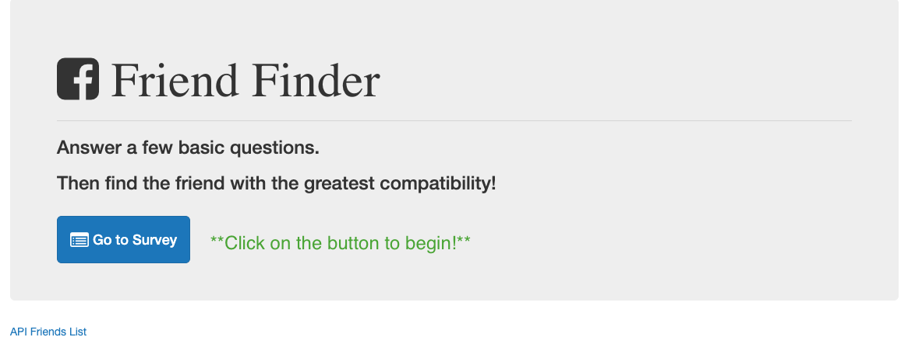

# Friend-Finder

Friend Finder is a match-maker app that takes in data based on how a user answers questions & gives them a total score. The app then takes that score & matches them with other users that have a similar score!

Instructions:

1. Click on "Find your Match!" 

2. Fill out the Survey 

3. Submit and Enjoy your Match! 

## Technologies Used:
1. Node.js
2. Express.js
3. HerokuApp to Deploy